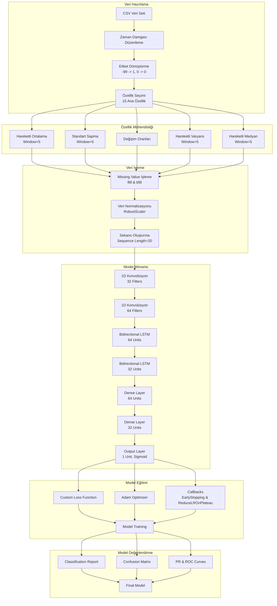
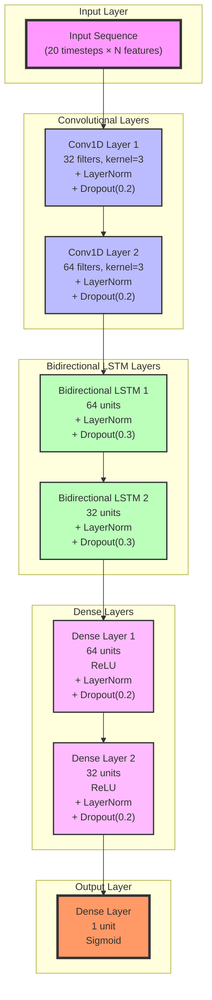

# matay_project

projeyi çalıştırmak için train ve test datasetlerini Colab'a upload edin ve MatayV2.ipynb dosyasındaki kodları çalıştırın

## Akış Diyagramı

## NN Architecture

# Deep Learning Architecture for Welding Fault Detection

## Introduction
The presented code implements a sophisticated deep learning architecture designed for predictive fault detection in robotic welding processes. The model utilizes a hybrid approach combining Convolutional Neural Networks (CNNs) and Bidirectional Long Short-Term Memory (BiLSTM) networks to capture both spatial and temporal patterns in sensor data.

## Data Preprocessing and Feature Engineering
The raw sensor data undergoes extensive preprocessing to enhance the model's learning capabilities. The temporal data is structured with timestamps and binary fault labels, where -99 indicates a fault occurrence (converted to 1) and 0 represents normal operation. The feature space comprises 15 primary sensor measurements including current, voltage, and power metrics.

Feature engineering involves the creation of rolling statistics with a window size of 5, including:
- Moving averages: $$MA(t) = \frac{1}{w}\sum_{i=t-w+1}^{t} x_i$$
- Rolling standard deviation: $$\sigma(t) = \sqrt{\frac{1}{w-1}\sum_{i=t-w+1}^{t} (x_i - \mu)^2}$$
- Rate of change: $$\Delta x(t) = x_t - x_{t-1}$$
- Moving variance and median calculations

Data normalization is performed using RobustScaler to handle outliers effectively, following the transformation:
$$x_{scaled} = \frac{x - Q_1}{Q_3 - Q_1}$$
where $$Q_1$$ and $$Q_3$$ represent the first and third quartiles respectively.

## Sequence Generation and Processing
Time series sequences are generated with a length of 20 timesteps, incorporating a pre-fault window of 150 timesteps for fault cases. The sequence generation process implements an advanced sampling strategy to address class imbalance, maintaining a ratio of 3:1 between normal and fault sequences.

## Neural Network Architecture
The model architecture consists of multiple specialized layers:

### Convolutional Layers
Two 1D convolutional layers process the input sequences:
$$Conv1D_1(x) = \sigma(W_1 * x + b_1)$$
$$Conv1D_2(x) = \sigma(W_2 * Conv1D_1(x) + b_2)$$

where * denotes the convolution operation and $$\sigma$$ represents the ReLU activation function:
$$\sigma(x) = max(0, x)$$

### Bidirectional LSTM Layers
The BiLSTM layers process the sequence in both forward and backward directions:
$$\vec{h_t} = LSTM_{forward}(x_t, \vec{h_{t-1}})$$
$$\overleftarrow{h_t} = LSTM_{backward}(x_t, \overleftarrow{h_{t+1}})$$

The final output combines both directions:
$$h_t = [\vec{h_t}, \overleftarrow{h_t}]$$

### Dense Layers and Regularization
Each dense layer applies the transformation:
$$z_l = W_l h_{l-1} + b_l$$
$$h_l = \sigma(LayerNorm(z_l))$$

Layer normalization is applied as:
$$LayerNorm(x) = \gamma \frac{x - \mu}{\sqrt{\sigma^2 + \epsilon}} + \beta$$

Dropout is implemented with probabilities of 0.2 and 0.3 for different layers:
$$h_{dropped} = h \odot Bernoulli(p)$$

## Loss Function and Training
The custom loss function incorporates class weights and confidence penalties:
$$L(y, \hat{y}) = BCE(y, \hat{y}) \cdot w(y) \cdot c(\|y - \hat{y}\|)$$

where $$BCE$$ is binary cross-entropy, $$w(y)$$ is the class weight function, and $$c(x)$$ is the confidence penalty function.

The Adam optimizer is utilized with the following parameters:
- Learning rate: $$\alpha = 0.001$$
- Exponential decay rates: $$\beta_1 = 0.9$$, $$\beta_2 = 0.999$$
- Epsilon: $$\epsilon = 10^{-7}$$

## Model Evaluation
Performance evaluation includes multiple metrics:
- Precision-Recall curve and AUC
- ROC curve and AUC
- Confusion matrix analysis
- Classification report with precision, recall, and F1-score

The model implements early stopping and learning rate reduction strategies to prevent overfitting and optimize convergence. The validation process uses a split ratio of 0.2, with stratification to maintain class distribution.

# Comprehensive Dataset Description for Robotic Welding Process

## Temporal Information

| Feature | Data Type | Format/Range | Description |
|---------|-----------|--------------|-------------|
| timestamp | datetime64[ns] | ISO8601 UTC | High-precision timestamp capturing the exact moment of measurement, essential for temporal analysis and sequence modeling |

## Current Measurements

| Feature | Data Type | Range | Unit | Purpose & Description |
|---------|-----------|--------|------|---------------------|
| Current L1 | float64 | 0.0 - 5.0 | A | Line 1 current measurement. Monitors the current flow in phase 1 of the welding circuit. Critical for detecting phase imbalances and overload conditions |
| Current L2 | float64 | 0.0 - 5.0 | A | Line 2 current measurement. Monitors phase 2 current flow. Important for three-phase balance analysis |
| Current L3 | float64 | 0.0 - 5.0 | A | Line 3 current measurement. Monitors phase 3 current flow. Completes the three-phase current monitoring system |
| Current Unbalance | float64 | 0.0 - 100.0 | % | Percentage difference between phase currents. Calculated as: $$\frac{max(|I_1-I_2|,|I_2-I_3|,|I_3-I_1|)}{I_{avg}} \times 100$$ Critical for detecting asymmetric loading |
| Neutral Current | float64 | 0.0 - 2.0 | A | Current in the neutral conductor. Should be minimal in balanced systems. High values indicate potential phase imbalance or harmonics |

## Voltage Measurements

| Feature | Data Type | Range | Unit | Purpose & Description |
|---------|-----------|--------|------|---------------------|
| Voltage L1-L2 | float64 | 380.0 - 420.0 | V | Line voltage between phases 1 and 2. Critical for monitoring power quality and phase-to-phase voltage stability |
| Voltage L2-L3 | float64 | 380.0 - 420.0 | V | Line voltage between phases 2 and 3. Part of complete three-phase voltage monitoring |
| Voltage L3-L1 | float64 | 380.0 - 420.0 | V | Line voltage between phases 3 and 1. Completes the line-to-line voltage measurement set |
| Voltage L1-N | float64 | 220.0 - 240.0 | V | Phase 1 to neutral voltage. Important for single-phase load analysis |
| Voltage L2-N | float64 | 220.0 - 240.0 | V | Phase 2 to neutral voltage. Monitors phase 2 voltage relative to neutral |
| Voltage L3-N | float64 | 220.0 - 240.0 | V | Phase 3 to neutral voltage. Completes phase-to-neutral voltage monitoring |
| Voltage Unbalance | float64 | 0.0 - 5.0 | % | Percentage of voltage imbalance between phases. Calculated as: $$\frac{max(|V_1-V_2|,|V_2-V_3|,|V_3-V_1|)}{V_{avg}} \times 100$$ |

## Power Measurements

| Feature | Data Type | Range | Unit | Purpose & Description |
|---------|-----------|--------|------|---------------------|
| ΣActive Power | float64 | 0.0 - 100.0 | kW | Total real power consumption. Represents actual work being done. Calculated as: $$P = \sum_{i=1}^3 V_i I_i \cos(\phi_i)$$ |
| ΣApparent Power | float64 | 0.0 - 120.0 | kVA | Total apparent power. Vector sum of active and reactive power. Calculated as: $$S = \sum_{i=1}^3 V_i I_i$$ |
| ΣCos Phi | float64 | -1.0 to 1.0 | - | Power factor angle cosine. Indicates the phase angle between voltage and current. Optimal value is close to ±1 |
| ΣPower Factor | float64 | -1.0 to 1.0 | - | Ratio of active to apparent power. Calculated as: $$PF = \frac{P}{S}$$ Indicates energy efficiency |

## Energy Measurements

| Feature | Data Type | Range | Unit | Purpose & Description |
|---------|-----------|--------|------|---------------------|
| Total Consumed Energy | float64 | ≥ 0.0 | kWh | Cumulative active energy consumption. Integral of active power over time: $$E = \int P dt$$ |
| Total Consumed Reactive Energy | float64 | ≥ 0.0 | kVArh | Cumulative reactive energy. Integral of reactive power over time: $$E_r = \int Q dt$$ |

## System Parameters

| Feature | Data Type | Range | Unit | Purpose & Description |
|---------|-----------|--------|------|---------------------|
| Measured Frequency | float64 | 49.5 - 50.5 | Hz | Power system frequency. Critical for system stability monitoring. Should remain close to nominal value (50 Hz) |
| Fault | int8 | {0, -99} | - | Fault indicator. Values: 0: Normal operation -99: Fault detected |

## Derived Metrics and Calculations

### Power Quality Indicators

The dataset enables calculation of several important power quality metrics:

Total Harmonic Distortion (THD):
$$THD = \sqrt{\sum_{n=2}^{\infty} \left(\frac{I_n}{I_1}\right)^2} \times 100\%$$

Phase Unbalance Factor:
$$\text{Unbalance}_{\text{phase}} = \frac{\text{max deviation from average}}{\text{average}} \times 100\%$$

### Energy Efficiency Metrics

Overall system efficiency can be monitored through:

Power Factor Quality:
$$PF_{\text{quality}} = \frac{\text{Active Power}}{\sqrt{(\text{Active Power})^2 + (\text{Reactive Power})^2}}$$

## Data Quality Considerations

- Sampling Rate: 1 millisecond resolution
- Missing Values: Handled through forward and backward filling
- Outlier Detection: Based on physical constraints and statistical analysis
- Signal Noise: Typical industrial environment noise levels present

## Operational Context

The dataset captures the complete electrical characteristics of a robotic welding process, enabling:
- Real-time monitoring of welding quality
- Predictive maintenance through pattern analysis
- Power quality assessment
- Energy efficiency optimization
- Fault prediction and detection

Each parameter has been carefully selected to provide comprehensive coverage of the welding process dynamics while maintaining practical relevance for industrial applications.
