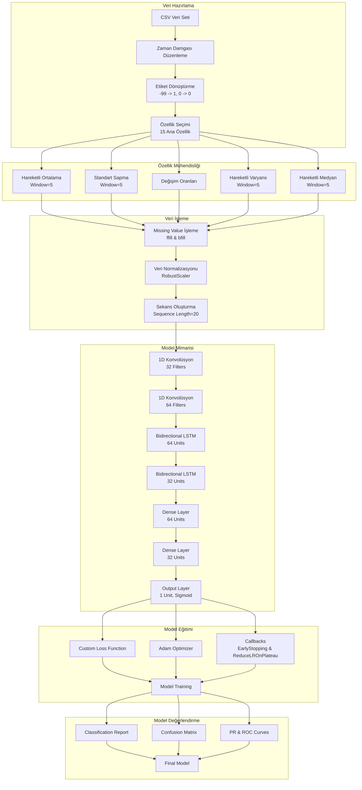

# matay_project

projeyi çalıştırmak için train ve test datasetlerini Colab'a upload edin ve MatayV2.ipynb dosyasındaki kodları çalıştırın

```mermaid
flowchart TB
    subgraph Data_Preparation["Veri Hazırlama"]
        A[CSV Veri Seti] --> B[Zaman Damgası Düzenleme]
        B --> C[Etiket Dönüştürme<br>-99 -> 1, 0 -> 0]
        C --> D[Özellik Seçimi<br>15 Ana Özellik]
    end

    subgraph Feature_Engineering["Özellik Mühendisliği"]
        D --> E1[Hareketli Ortalama<br>Window=5]
        D --> E2[Standart Sapma<br>Window=5]
        D --> E3[Değişim Oranları]
        D --> E4[Hareketli Varyans<br>Window=5]
        D --> E5[Hareketli Medyan<br>Window=5]
    end

    subgraph Data_Processing["Veri İşleme"]
        E1 & E2 & E3 & E4 & E5 --> F[Missing Value İşleme<br>ffill & bfill]
        F --> G[Veri Normalizasyonu<br>RobustScaler]
        G --> H[Sekans Oluşturma<br>Sequence Length=20]
    end

    subgraph Model_Architecture["Model Mimarisi"]
        H --> I1[1D Konvolüsyon<br>32 Filters]
        I1 --> I2[1D Konvolüsyon<br>64 Filters]
        I2 --> J1[Bidirectional LSTM<br>64 Units]
        J1 --> J2[Bidirectional LSTM<br>32 Units]
        J2 --> K1[Dense Layer<br>64 Units]
        K1 --> K2[Dense Layer<br>32 Units]
        K2 --> L[Output Layer<br>1 Unit, Sigmoid]
    end

    subgraph Training["Model Eğitimi"]
        L --> M1[Custom Loss Function]
        L --> M2[Adam Optimizer]
        L --> M3[Callbacks<br>EarlyStopping & ReduceLROnPlateau]
        M1 & M2 & M3 --> N[Model Training]
    end

    subgraph Evaluation["Model Değerlendirme"]
        N --> O1[Classification Report]
        N --> O2[Confusion Matrix]
        N --> O3[PR & ROC Curves]
        O1 & O2 & O3 --> P[Final Model]
    end

```
