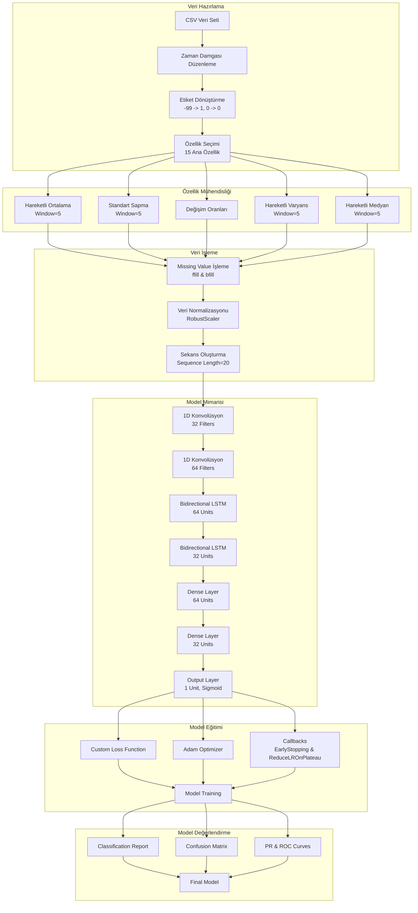
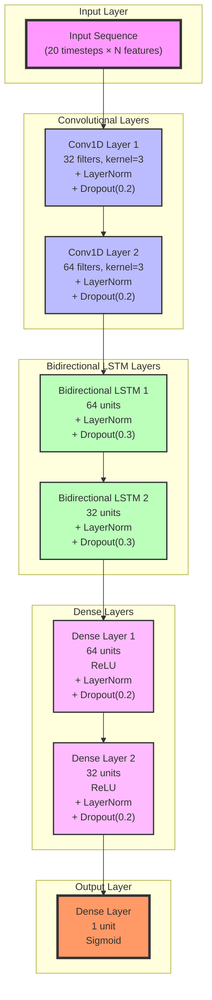

# matay_project

projeyi çalıştırmak için train ve test datasetlerini Colab'a upload edin ve MatayV2.ipynb dosyasındaki kodları çalıştırın

## Akış Diyagramı

## NN Architecture

# Deep Learning Architecture for Welding Fault Detection

## Introduction
The presented code implements a sophisticated deep learning architecture designed for predictive fault detection in robotic welding processes. The model utilizes a hybrid approach combining Convolutional Neural Networks (CNNs) and Bidirectional Long Short-Term Memory (BiLSTM) networks to capture both spatial and temporal patterns in sensor data.

## Data Preprocessing and Feature Engineering
The raw sensor data undergoes extensive preprocessing to enhance the model's learning capabilities. The temporal data is structured with timestamps and binary fault labels, where -99 indicates a fault occurrence (converted to 1) and 0 represents normal operation. The feature space comprises 15 primary sensor measurements including current, voltage, and power metrics.

Feature engineering involves the creation of rolling statistics with a window size of 5, including:
- Moving averages: $MA(t) = \frac{1}{w}\sum_{i=t-w+1}^{t} x_i$
- Rolling standard deviation: $$\sigma(t) = \sqrt{\frac{1}{w-1}\sum_{i=t-w+1}^{t} (x_i - \mu)^2}$$
- Rate of change: $$\Delta x(t) = x_t - x_{t-1}$$
- Moving variance and median calculations

Data normalization is performed using RobustScaler to handle outliers effectively, following the transformation:
$$x_{scaled} = \frac{x - Q_1}{Q_3 - Q_1}$$
where $$Q_1$$ and $$Q_3$$ represent the first and third quartiles respectively.

## Sequence Generation and Processing
Time series sequences are generated with a length of 20 timesteps, incorporating a pre-fault window of 150 timesteps for fault cases. The sequence generation process implements an advanced sampling strategy to address class imbalance, maintaining a ratio of 3:1 between normal and fault sequences.

## Neural Network Architecture
The model architecture consists of multiple specialized layers:

### Convolutional Layers
Two 1D convolutional layers process the input sequences:
$$Conv1D_1(x) = \sigma(W_1 * x + b_1)$$
$$Conv1D_2(x) = \sigma(W_2 * Conv1D_1(x) + b_2)$$

where * denotes the convolution operation and $$\sigma$$ represents the ReLU activation function:
$$\sigma(x) = max(0, x)$$

### Bidirectional LSTM Layers
The BiLSTM layers process the sequence in both forward and backward directions:
$$\vec{h_t} = LSTM_{forward}(x_t, \vec{h_{t-1}})$$
$$\overleftarrow{h_t} = LSTM_{backward}(x_t, \overleftarrow{h_{t+1}})$$

The final output combines both directions:
$$h_t = [\vec{h_t}, \overleftarrow{h_t}]$$

### Dense Layers and Regularization
Each dense layer applies the transformation:
$$z_l = W_l h_{l-1} + b_l$$
$$h_l = \sigma(LayerNorm(z_l))$$

Layer normalization is applied as:
$$LayerNorm(x) = \gamma \frac{x - \mu}{\sqrt{\sigma^2 + \epsilon}} + \beta$$

Dropout is implemented with probabilities of 0.2 and 0.3 for different layers:
$$h_{dropped} = h \odot Bernoulli(p)$$

## Loss Function and Training
The custom loss function incorporates class weights and confidence penalties:
$$L(y, \hat{y}) = BCE(y, \hat{y}) \cdot w(y) \cdot c(\|y - \hat{y}\|)$$

where $$BCE$$ is binary cross-entropy, $$w(y)$$ is the class weight function, and $$c(x)$$ is the confidence penalty function.

The Adam optimizer is utilized with the following parameters:
- Learning rate: $$\alpha = 0.001$$
- Exponential decay rates: $$\beta_1 = 0.9$$, $$\beta_2 = 0.999$$
- Epsilon: $$\epsilon = 10^{-7}$$

## Model Evaluation
Performance evaluation includes multiple metrics:
- Precision-Recall curve and AUC
- ROC curve and AUC
- Confusion matrix analysis
- Classification report with precision, recall, and F1-score

The model implements early stopping and learning rate reduction strategies to prevent overfitting and optimize convergence. The validation process uses a split ratio of 0.2, with stratification to maintain class distribution.

