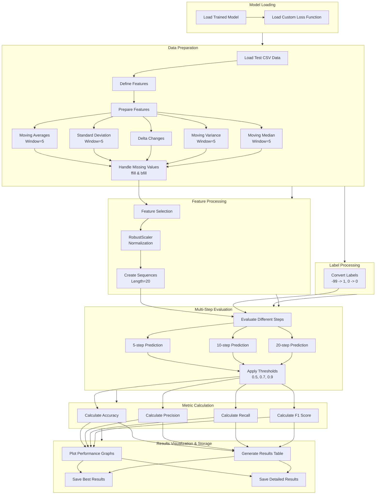

# Multi-Step Prediction Testing Framework for Welding Fault Detection

## Introduction
This testing framework implements a comprehensive evaluation methodology for assessing the performance of a deep learning model designed for welding fault prediction. The framework incorporates multi-step prediction capabilities with varying prediction horizons and threshold values, enabling robust assessment of the model's predictive accuracy across different temporal scales.

## Custom Loss Function Implementation
The framework utilizes a specialized loss function that incorporates both class weighting and confidence penalties. The loss computation is defined as:

$$
L(y, \hat{y}) = BCE(y, \hat{y}) \cdot w(y) \cdot c(\|y - \hat{y}\|)
$$

where the confidence penalty c(x) is formulated as:

$$
c(x) = \begin{cases} 
3.0, & \text{if } |y - \hat{y}| > 0.7 \\
2.0, & \text{if } 0.3 < |y - \hat{y}| \leq 0.7 \\
1.0, & \text{otherwise}
\end{cases}
$$

## Feature Engineering Process
The feature preparation process implements rolling statistics with adaptive window sizes. For each input feature f, the following derived features are computed:

Moving Average:

$$
MA_5(t) = \frac{1}{5}\sum_{i=t-4}^{t} f_i
$$

Rolling Standard Deviation:

$$
\sigma_5(t) = \sqrt{\frac{1}{4}\sum_{i=t-4}^{t} (f_i - MA_5(t))^2}
$$

Rate of Change:

$$
\Delta f(t) = f_t - f_{t-1}
$$

Rolling Variance:

$$
Var_5(t) = \frac{1}{4}\sum_{i=t-4}^{t} (f_i - MA_5(t))^2
$$

Moving Median:

$$
Median_5(t) = \text{median}\{f_{t-4}, f_{t-3}, f_{t-2}, f_{t-1}, f_t\}
$$

## Sequence Generation Methodology
The framework implements a sliding window approach for sequence generation, creating temporal sequences of length L=20. For a given feature matrix X, sequences are generated as:

$$
S_i = [X_i, X_{i+1}, ..., X_{i+L-1}]
$$

where i ranges from 0 to N-L+1, and N is the total number of samples.

## Multi-Step Prediction Evaluation
The evaluation process assesses model performance across multiple prediction horizons (h ∈ {5, 10, 20}) and threshold values (θ ∈ {0.5, 0.7, 0.9}). For each combination of horizon h and threshold θ, the following metrics are computed:

Accuracy:

$$
ACC = \frac{TP + TN}{TP + TN + FP + FN}
$$

Precision:

$$
P = \frac{TP}{TP + FP}
$$

Recall:

$$
R = \frac{TP}{TP + FN}
$$

F1 Score:

$$
F1 = 2 \cdot \frac{P \cdot R}{P + R}
$$

## Performance Visualization
The framework generates comprehensive visualization of performance metrics across different prediction horizons and thresholds. The visualization includes:

Time-Series Performance:

$$
Performance(h, θ) = f(h, θ, t)
$$

where h is the prediction horizon, θ is the threshold, and t is the time step.

## Statistical Analysis and Output
Results are analyzed through both tabular and graphical representations. For each prediction horizon h, the optimal threshold θ* is determined by maximizing the F1 score:

$$
θ^* = \argmax_θ F1(h, θ)
$$

The framework outputs detailed performance metrics in both CSV and tabular formats, facilitating further analysis and model comparison. Performance curves are generated to visualize the relationship between prediction accuracy and temporal horizon, enabling assessment of the model's temporal degradation characteristics.

## Implementation Architecture
The implementation follows a modular design pattern with distinct components for:
- Data preprocessing and feature engineering
- Sequence generation and normalization
- Multi-step prediction evaluation
- Metric computation and visualization
- Results storage and analysis

This modular approach ensures extensibility and facilitates the integration of additional evaluation metrics or visualization techniques.

## Technical Specifications
The framework is implemented using TensorFlow 2.x and scikit-learn, leveraging pandas for data manipulation and matplotlib/seaborn for visualization. RobustScaler is employed for feature normalization to handle outliers effectively:

$$
x_{scaled} = \frac{x - Q_1}{Q_3 - Q_1}
$$

where Q₁ and Q₃ represent the first and third quartiles respectively.

## Output Generation
The framework generates two primary output files:
- 'multi_step_prediction_results.csv': Comprehensive results for all prediction horizons and thresholds
- 'best_prediction_results.csv': Optimal results for each prediction horizon

These outputs enable detailed analysis of model performance and facilitate model comparison and optimization processes.

