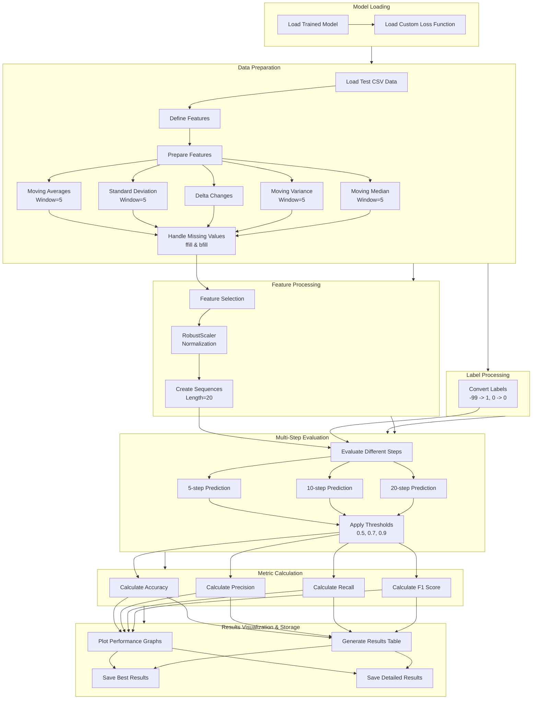

# Test Application Diagram

```mermaid
flowchart TB
    subgraph Model_Loading["Model Loading"]
        A[Load Trained Model] --> B[Load Custom Loss Function]
    end

    subgraph Data_Preparation["Data Preparation"]
        C[Load Test CSV Data] --> D[Define Features]
        D --> E[Prepare Features]
        E --> F1[Moving Averages<br>Window=5]
        E --> F2[Standard Deviation<br>Window=5]
        E --> F3[Delta Changes]
        E --> F4[Moving Variance<br>Window=5]
        E --> F5[Moving Median<br>Window=5]
        F1 & F2 & F3 & F4 & F5 --> G[Handle Missing Values<br>ffill & bfill]
    end

    subgraph Label_Processing["Label Processing"]
        H[Convert Labels<br>-99 -> 1, 0 -> 0]
    end

    subgraph Feature_Processing["Feature Processing"]
        G --> I[Feature Selection]
        I --> J[RobustScaler<br>Normalization]
        J --> K[Create Sequences<br>Length=20]
    end

    subgraph Multi_Step_Evaluation["Multi-Step Evaluation"]
        K & H --> L[Evaluate Different Steps]
        L --> M1[5-step Prediction]
        L --> M2[10-step Prediction]
        L --> M3[20-step Prediction]
        M1 & M2 & M3 --> N[Apply Thresholds<br>0.5, 0.7, 0.9]
    end

    subgraph Metric_Calculation["Metric Calculation"]
        N --> O1[Calculate Accuracy]
        N --> O2[Calculate Precision]
        N --> O3[Calculate Recall]
        N --> O4[Calculate F1 Score]
    end

    subgraph Visualization["Results Visualization & Storage"]
        O1 & O2 & O3 & O4 --> P1[Plot Performance Graphs]
        O1 & O2 & O3 & O4 --> P2[Generate Results Table]
        P1 & P2 --> Q1[Save Best Results]
        P1 & P2 --> Q2[Save Detailed Results]
    end

    Model_Loading --> Data_Preparation
    Data_Preparation --> Label_Processing
    Data_Preparation --> Feature_Processing
    Label_Processing & Feature_Processing --> Multi_Step_Evaluation
    Multi_Step_Evaluation --> Metric_Calculation
    Metric_Calculation --> Visualization

```
